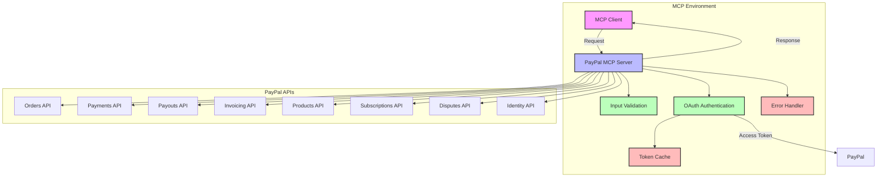

# PayPal MCP Server

[](https://opensource.org/licenses/MIT)
[](https://www.typescriptlang.org/)
[](https://nodejs.org/)

A Model Context Protocol (MCP) server that provides comprehensive integration with PayPal's APIs. This server enables seamless interaction with PayPal's payment processing, invoicing, subscription management, and business operations through a standardized interface.

## Features

### Payment Processing
- **Orders Management**: Create, update, and track orders
- **Payment Processing**: Process payments with various methods
- **Payment Tokens**: Create and manage payment tokens for future use
- **Dispute Management**: Handle payment disputes and resolutions

### Business Operations
- **Product Management**: Create and manage product catalogs
- **Invoicing**: Generate and send professional invoices
- **Payouts**: Process batch payouts to multiple recipients
- **Subscription Management**: Create and manage recurring billing

### User Management
- **Identity Verification**: Verify user identities
- **User Information**: Retrieve and manage user data
- **Web Profile Management**: Customize checkout experiences

## Architecture



## Installation

### Prerequisites

- Node.js 16.x or later
- PayPal Developer Account with API credentials

### Manual Installation

1. Clone the repository
   ```bash
   git clone https://github.com/arbuthnot-eth/PayPal-MCP.git
   cd PayPal-MCP
   ```

2. Install dependencies
   ```bash
   npm install
   ```

3. Build the project
   ```bash
   npm run build
   ```

4. Configure PayPal credentials in your MCP settings file:

   ```json
   {
     "mcpServers": {
       "paypal": {
         "command": "node",
         "args": ["path/to/paypal-mcp/build/index.js"],
         "env": {
           "PAYPAL_CLIENT_ID": "your_client_id",
           "PAYPAL_CLIENT_SECRET": "your_client_secret",
           "PAYPAL_ENVIRONMENT": "sandbox" // or "live"
         },
         "disabled": false,
         "autoApprove": []
       }
     }
   }
   ```

## Available Tools

### Payment Operations

#### create_payment_token

Create a payment token for future use.

```typescript
{
  customer: {
    id: string;
    email_address?: string;
  };
  payment_source: {
    card?: {
      name: string;
      number: string;
      expiry: string;
      security_code: string;
    };
    paypal?: {
      email_address: string;
    };
  };
}
```

#### create_order

Create a new order in PayPal.

```typescript
{
  intent: 'CAPTURE' | 'AUTHORIZE';
  purchase_units: Array<{
    amount: {
      currency_code: string;
      value: string;
    };
    description?: string;
    reference_id?: string;
    items?: Array<{
      name: string;
      quantity: string;
      unit_amount: {
        currency_code: string;
        value: string;
      };
    }>;
  }>;
  application_context?: {
    brand_name?: string;
    shipping_preference?: 'GET_FROM_FILE' | 'NO_SHIPPING' | 'SET_PROVIDED_ADDRESS';
    user_action?: 'CONTINUE' | 'PAY_NOW';
  };
}
```

#### capture_order

Capture payment for an authorized order.

```typescript
{
  order_id: string;
  payment_source?: {
    token?: {
      id: string;
      type: string;
    };
  };
}
```

#### create_subscription

Create a subscription for recurring billing.

```typescript
{
  plan_id: string;
  subscriber: {
    name: {
      given_name: string;
      surname: string;
    };
    email_address: string;
  };
  application_context?: {
    brand_name?: string;
    shipping_preference?: 'GET_FROM_FILE' | 'NO_SHIPPING' | 'SET_PROVIDED_ADDRESS';
    user_action?: 'CONTINUE' | 'SUBSCRIBE_NOW';
    payment_method?: {
      payer_selected?: string;
      payee_preferred?: string;
    };
  };
}
```

### Business Operations

#### create_product

Create a new product in the catalog.

```typescript
{
  name: string;
  description: string;
  type: 'PHYSICAL' | 'DIGITAL' | 'SERVICE';
  category: string;
  image_url?: string;
  home_url?: string;
}
```

#### create_invoice

Generate a new invoice.

```typescript
{
  invoice_number: string;
  reference: string;
  currency_code: string;
  recipient_email: string;
  items: Array<{
    name: string;
    quantity: string;
    unit_amount: {
      currency_code: string;
      value: string;
    };
    description?: string;
    tax?: {
      name: string;
      percent: string;
    };
  }>;
  note?: string;
  terms_and_conditions?: string;
  memo?: string;
  payment_term?: {
    term_type: 'DUE_ON_RECEIPT' | 'DUE_ON_DATE' | 'NET_10' | 'NET_15' | 'NET_30' | 'NET_45' | 'NET_60' | 'NET_90';
    due_date?: string;
  };
}
```

#### create_payout

Process a batch payout.

```typescript
{
  sender_batch_header: {
    sender_batch_id: string;
    email_subject?: string;
    recipient_type?: string;
  };
  items: Array<{
    recipient_type: string;
    amount: {
      value: string;
      currency: string;
    };
    receiver: string;
    note?: string;
  }>;
}
```

## Error Handling

The server implements comprehensive error handling:

- **Input Validation**: Detailed validation errors with specific messages
- **PayPal API Errors**: Structured error responses with PayPal error details
- **Network Errors**: Retry logic for transient network issues
- **Authentication Errors**: Automatic token refresh and clear error messages
- **Rate Limiting**: Backoff strategies for API rate limits

## Security Considerations

- All sensitive data is validated and sanitized
- OAuth 2.0 authentication with PayPal
- Secure credential management through environment variables
- Input validation for all API parameters
- Error messages don't expose sensitive information

## Development

### Building

```bash
npm run build
```

### Running in Development Mode

```bash
npm run dev
```

### Testing

```bash
npm test
```

### Linting

```bash
npm run lint
```

### Formatting

```bash
npm run format
```

## Contributing

1. Fork the repository
2. Create a feature branch
3. Commit your changes
4. Push to the branch
5. Create a Pull Request

## License

MIT License
